# Library Management System – Python 202 Bootcamp Project

# Proje Amacı

Bu proje, değerli GLOBAL AI HUB'ın Python 202 Bootcamp'i için oluşturulmuş bir **Kütüphane Yönetim Sistemi (Library Management System)** simülasyonudur.

Bu proje kapsamında kullanıcılar, terminal üzerinden karşılarına çıkan menüdeki seçeneklere göre (Kitapları Listeleme, OpenLibrary API'si üzerinden ISBN numarasını kullanarak kitap ekleme, manuel bir şekilde kitap ekleme, ISBN numarasına göre kitap silme, çıkış işlemi gibi işlemler) çeşitli işlemleri gerçekleştirebilirler.

Bu gerçekleştirilen işlemlerin kalıcı bir şekilde library.json isimli dosyada tutulması, FastAPI kullanılarak inşa edilen API ile de ilgili işlemlerin görüntülenmesi amaçlanmaktadır.

Test işlemleri ile de olası hataların önüne geçilmesi sağlanmıştır.

Ayrıca, FastAPI kullanılarak bir web servisine dönüştürülen projemiz ile kitap verilerine API üzerinden de erişim sağlanabilmektedir.

## İçindekiler

- [Proje Amacı](#proje-amacı)
- [Gereksinimler](#gereksinimler)
- [Kurulum ve Çalıştırma](#kurulum-ve-çalıştırma)
- [Kullanım](#kullanım)
  - [Terminal Uygulaması](#terminal-uygulaması)
  - [FastAPI Sunucusu](#fastapi-sunucusu)
- [Testler](#testler)
- [Uygulamaya Ait Ekran Görüntüleri](#uygulamaya-ait-ekran-görüntüleri)
- [Gelecek Planlar ve Geliştirme Önerileri](#gelecek-planlar-ve-geliştirme-önerileri)
- [Yararlanılan Kaynaklar](#yararlanılan-kaynaklar)

## Gereksinimler

- Python 3.11+
- [httpx](https://pypi.org/project/httpx/) >=0.24.0 – OpenLibrary API isteği için
- [pytest](https://pypi.org/project/pytest/) >=8.0.0 – Test senaryoları için
- [pytest-mock](https://pypi.org/project/pytest-mock/) >=3.11.0 – API testlerinde mock işlemleri için
- [fastapi](https://pypi.org/project/fastapi/) >=0.116.0 – API endpoint tanımlamaları için
- [uvicorn](https://pypi.org/project/uvicorn/) >=0.35.0 – API server için
- [pydantic](https://pypi.org/project/pydantic/) >=2.11.0 – Veri doğrulama ve tutarlılık

## Kurulum ve Çalıştırma

Gerekli harici kütüphaneleri kurabilmek ve uygulamayı düzgün bir şekilde çalıştırabilmek için yapmanız gerekenler aşağıda yer almaktadır.

```bash

pip install -r requirements.txt

```

Konsolda çalıştırmak için yapmanız gereken ise şu şekildedir:

```
python main.py
```

FastAPI Sunucusunu çalıştırabilmeniz icin:

```
uvicorn api:app --reload
```

### Terminal Uygulaması:

Terminal uygulamamız da bir menü üzerinden kullanıcıların seçim yapması istenmektedir.
Menü de bu şekildedir:

1. Kitap Ekle (Add Book)
2. Kitap Sil (Remove Book)
3. Kitapları Listele (List Books)
4. Kitap Ara (Find Book)
5. Çıkış (Quit)

### FastAPI Sunucusu

- GET /books → Kütüphanedeki tüm kitapları listeleyen end-pointtir.
- GET/books/{ISBN} → Girilen ISBN numarasına göre ilgili kitabı getiren end-pointtir.
- POST /books/{ISBN} → ISBN numarasına göre Open Library üzerinden kitap eklemeyi sağlayan end-pointtir.
- POST/books → Manuel bir şekilde kitap eklemeyi sağlayan end-pointtir.
- DELETE /books/{isbn} → Belirtilen ISBN numarasına göre kitabı silen end-pointtir.

## Kullanım

<table>
  <thead>
    <tr>
      <th>Endpoint</th>
      <th>Method</th>
      <th>Açıklama</th>
    </tr>
  </thead>
  <tbody>
    <tr>
      <td>/books</td>
      <td>GET</td>
      <td>Tüm kitapları listeler</td>
    </tr>
    <tr>
      <td>/books/{ISBN}</td>
      <td>GET</td>
      <td>Girilen ISBN numarasına göre ilgili kitabı getirir</td>
    </tr>
    <tr>
      <td>/books/{ISBN}</td>
      <td>POST</td>
      <td>ISBN numarasına göre OpenLibrary'den kitap ekler</td>
    </tr>
    <tr>
      <td>/books</td>
      <td>POST</td>
      <td>Manuel kitap eklemeyi sağlar</td>
    </tr>
    <tr>
      <td>/books/{ISBN}</td>
      <td>DELETE</td>
      <td>Belirtilen ISBN numarasına göre kitabı siler</td>
    </tr>
  </tbody>
</table>

### Testler

Projemizde pytest ve unittest kullanılmıştır.
Kullanılan test dosyaları ise şu şekildedir:

- book_test.py => book_oop.py dosyasında bulunan kitapların doğru bir şekilde oluşup oluşmadığını test eden test_book_creation() fonksiyonunu içermektedir.

- library_test.py: library.py dosyasında yer alan metotları test etmektedir.
  İçerisinde:
  create_library_sample()

  test_book_add(monkeypatch)

  test_remove_book()

  test_list_books()

  test_find_book()

  test_load_books(tmp_path)

  test_save_books(tmp_path)

  bulunmaktadır.

  Burada library.json dosyamız yapılan değişikliklerden etkilenmesin diye, tmp_path yani geçici bir dosya yolu kullanılmıştır.

- test_api.py
  İçinde yer alan fonksiyonlar da şu şekildedir:

  test_library(tmp_path,monkeypatch)

  test_add_book_by_ISBN(mock_get, test_library)

  test_add_book_manually_success(test_library)

  test_add_book_manually_missing_fields(test_library)

  test_delete_book_by_ISBN(test_library)

  test_get_books(test_library)

  test_get_book_by_ISBN(test_library)

  test_get_wrong_ISBN(test_library)

  test_add_book_empty_author(test_library)

  fonksiyonları bulunmaktadır.

  Burada da ana dosyamız olan (library.json) etkilenmemesi amacıyla geçici bir test dosyası üzerinde işlemler gerçekleştirilmiştir.

## Uygulamaya Ait Ekran Görüntüleri

Konsol İçin:

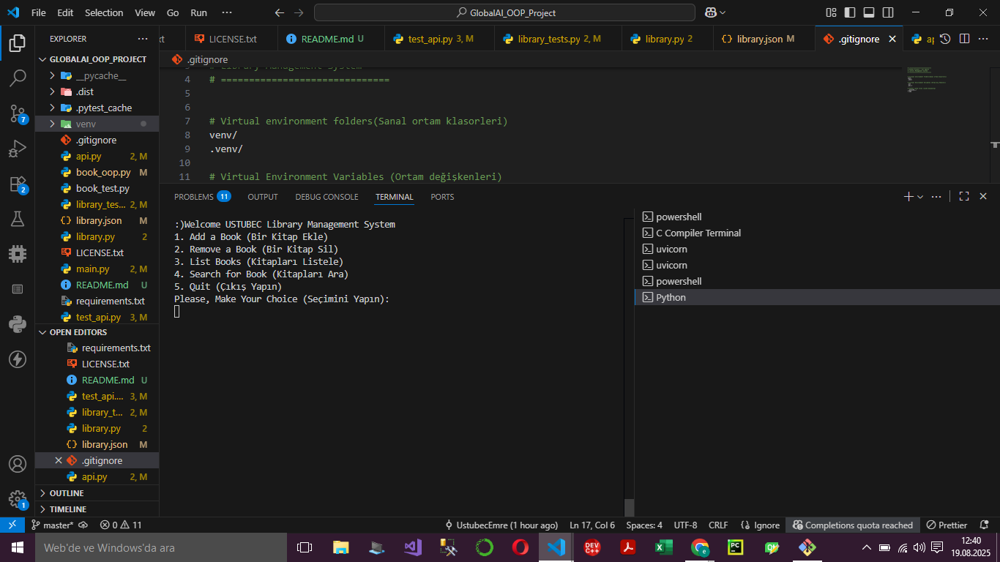

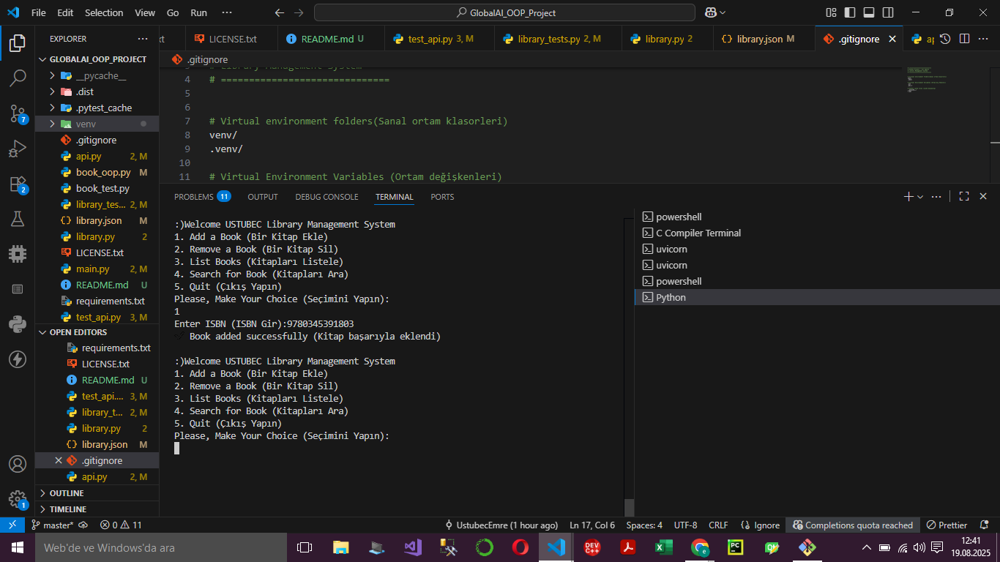

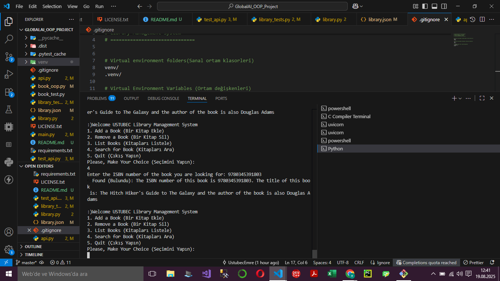

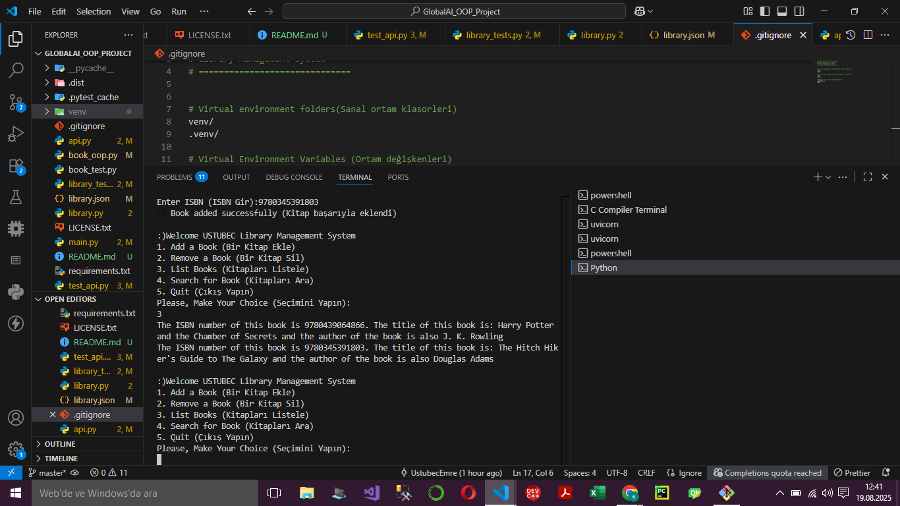


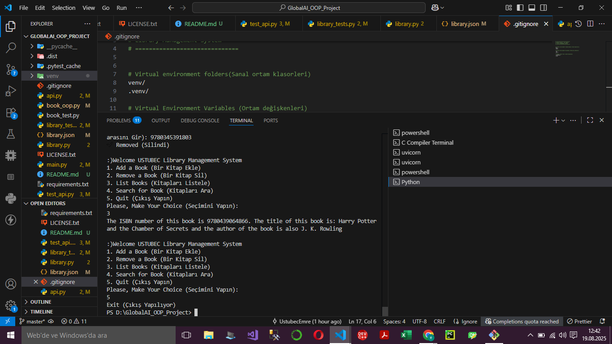

<hr>
FastAPI İçin

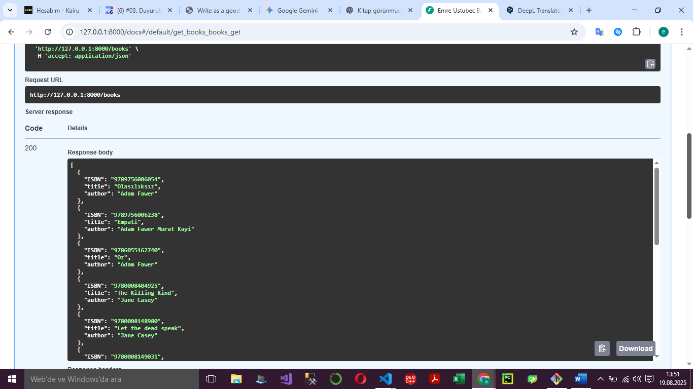


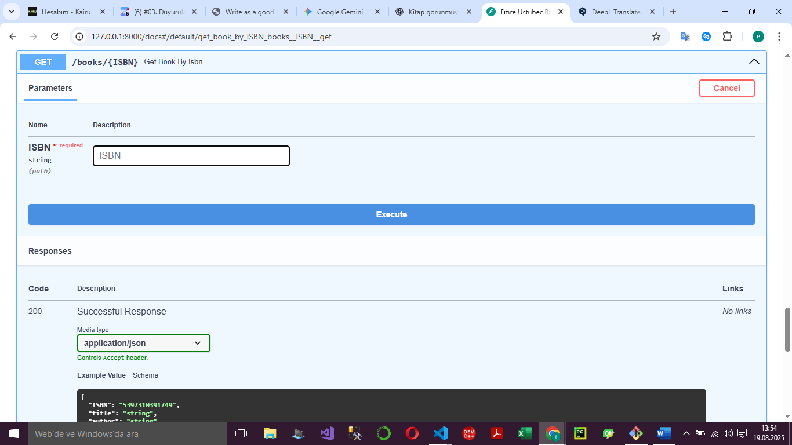

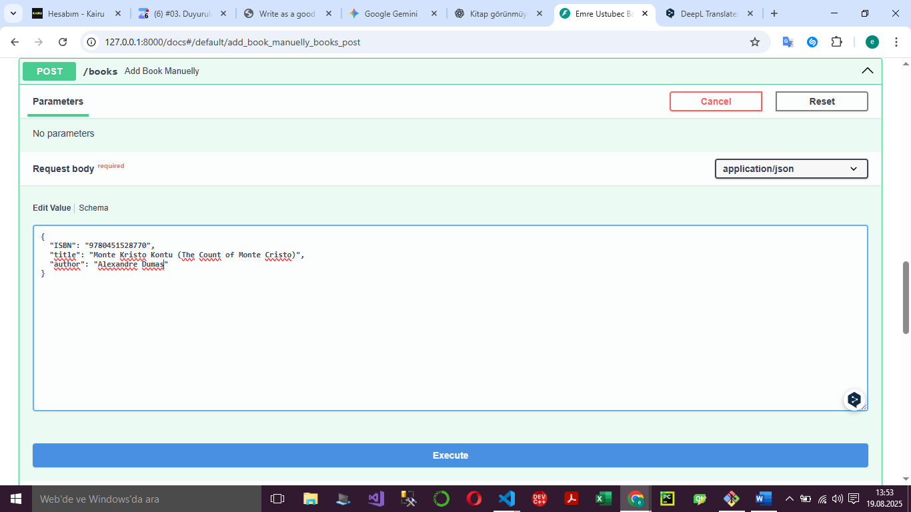

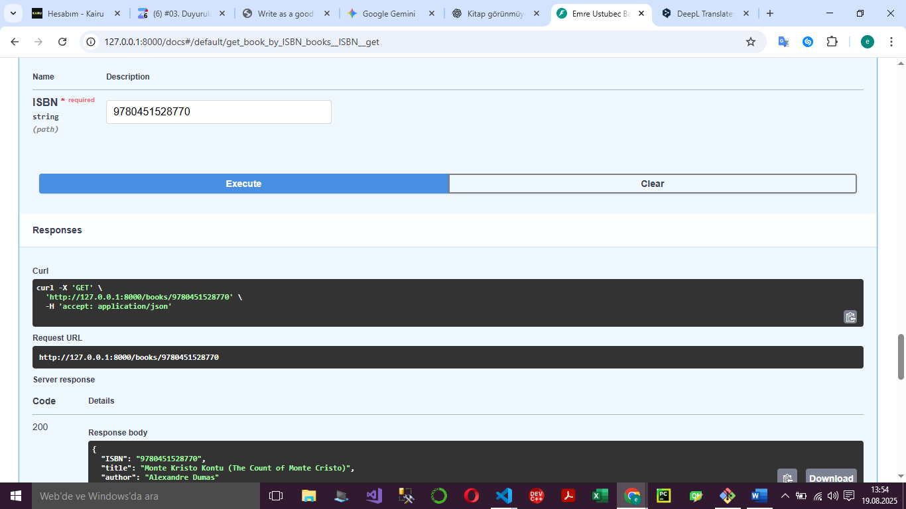

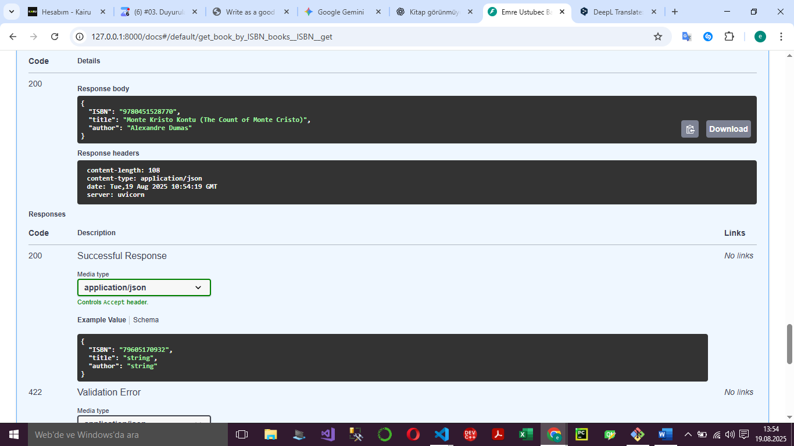

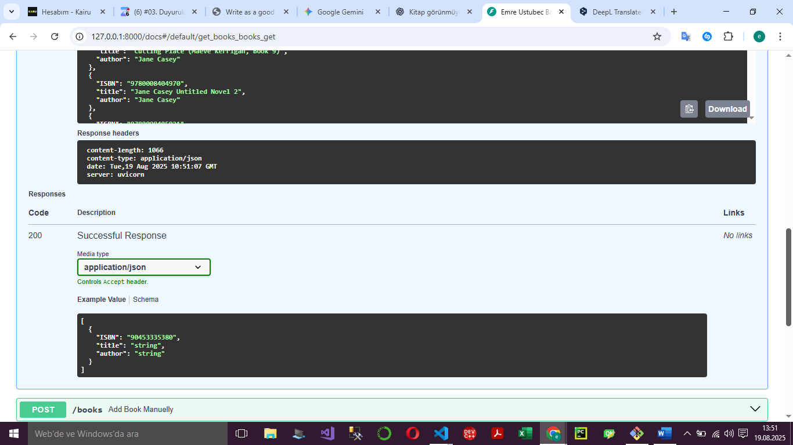

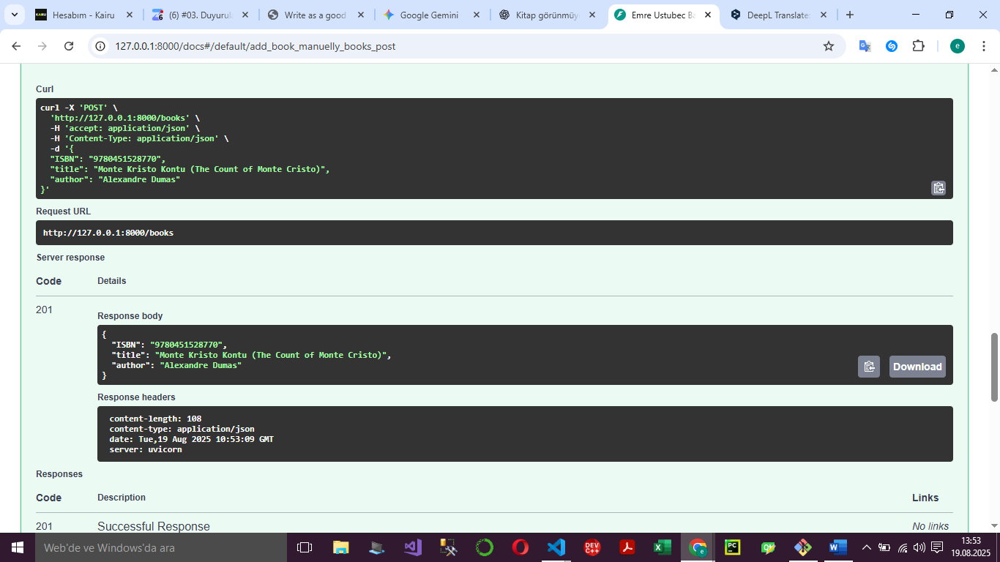

<hr>

Test İçin:

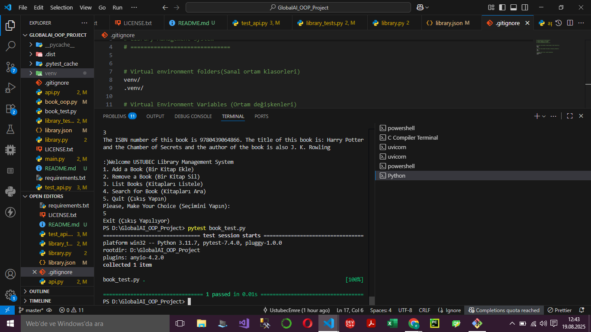

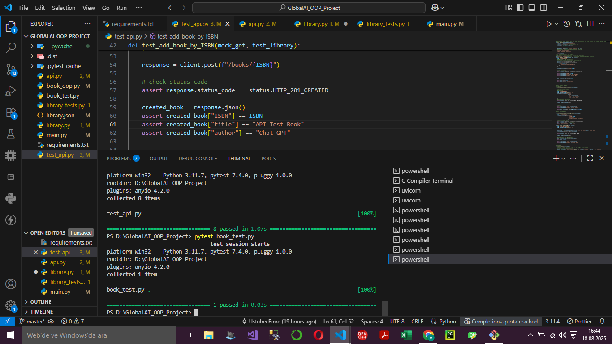

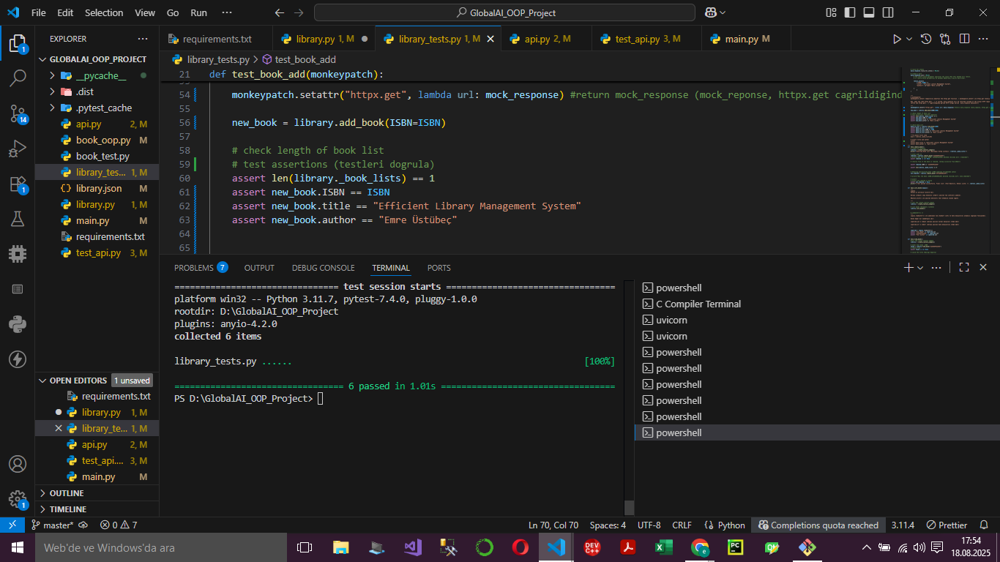

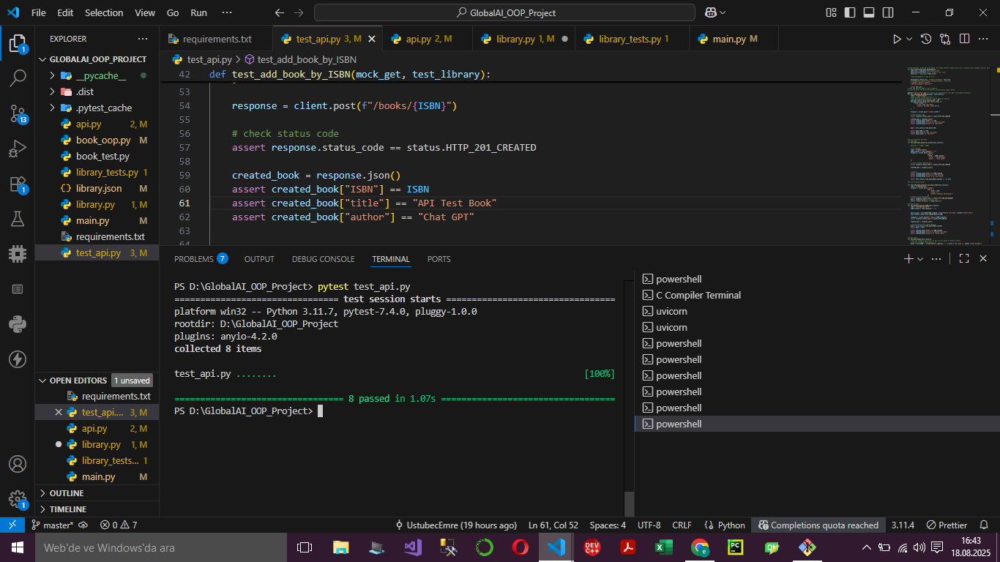

## Gelecek Planlar ve Geliştirme Önerileri

Bu projenin daha kapsamlı bir hale getirilebilmesi amacıyla, library.json gibi bir dosya yerine MS SQL, MongoDB veya SqlLite gibi veritabanları kullanılabilir, burada bilgilerin yönetilmesi, kalıcılığının sağlanması gerçekleştirilecektir.

Kullanıcıların terminal üzerinden gerçekleştireceği işlemler için HTML, CSS, React ve JavaScript kullanılarak etkileşimli bir görsel yüz oluşturulacaktır.

İlerleyen zamanlarda asenkron işlemler için async yapısı kullanılabilir.

### Yararlanılan Kaynaklar

Test, FastAPI gibi bazı konularda çok az bir bilgim olduğundan dolayı araştırma gereği duydum. Bu araştırmalarımda kullandığım bazı kaynaklar şu şekildedir:

- Global AI Uğurcan hocamızın ders pdf'leri
- Turkish AI Hub => Youtube Kanalı => Python 202 Bootcamp dersleri
- Tech With Tim => Youtube kanalı => pytest (Please Learn How To Write Tests in Python)
- Pixegami => Youtube kanalı => pytest, fastapi (Python FastAPI Tutorial: Build a REST API in 15 Minutes)
- NeuralNine => Youtube kanalı => FastAPI Full Crash Course
- Gemini, Chat GPT gibi büyük dil modelleri
